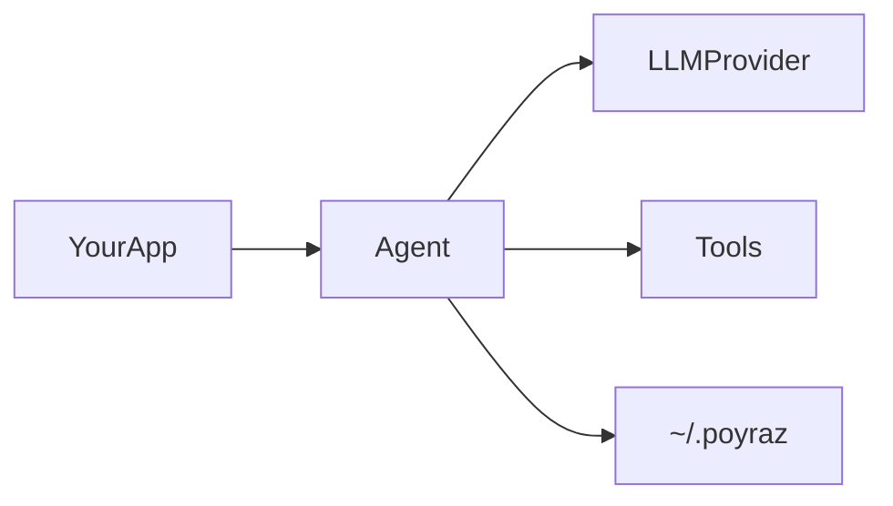

# How it works

This page describes how Poyraz behaves when you embed it in your app — not the package’s source layout.

## Runtime flow

1. You configure an agent with `AgentBuilder` (model, tools, identity, routing).
2. `Build()` returns an `Agent`. Call `init()`, then `chat()`.
3. Each turn the model may call tools; Poyraz runs them, applies **mode** and **routing** policy, and streams events to your handlers.
4. Credentials and MCP config are read from the environment and/or `~/.poyraz/`.

## Pieces you interact with

| Piece | Role in your app |
|-------|------------------|
| `AgentBuilder` / `Agent` | Configure and run conversations |
| Model profiles | Pick OpenAI, Groq, Gemini, OpenRouter, or Ollama |
| Tool presets / custom tools | What the model is allowed to call |
| Modes | Restrict tools per turn (`agent`, `plan`, `ask`, `chat`) |
| `ChatHandlers` | Stream text and tool events into your UI |
| `~/.poyraz` | Global auth (`.env`), MCP (`mcp.json`), synced templates |
| Project `.poyraz/` | Optional trust flag and file logs for a workspace |

## Chat turn (simplified)

1. User message enters `agent.chat`.
2. System prompt includes identity, mode directive, tool guidance, and current todos when relevant.
3. The provider streams tokens; tool calls are executed under policy (max rounds, repeat limits, mode denylists).
4. The turn ends with assistant text and token usage; you can abort via `AbortSignal`.

## Data on disk

| Location | Used for |
|----------|----------|
| `~/.poyraz/.env` | API keys and related env vars |
| `~/.poyraz/mcp.json` | MCP server definitions |
| `~/.poyraz/data/configs/templates/` | Synced / custom agent templates |
| `<project>/.poyraz/` | Workspace trust and logs (when you enable them) |

See [Auth and providers](auth-and-providers.md), [Workspace](workspace.md), and [Agent API](agent-api.md).
